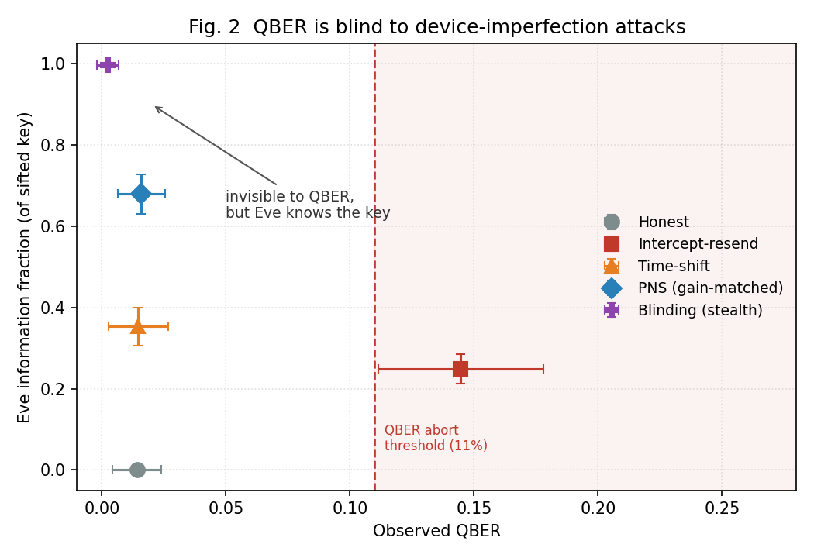
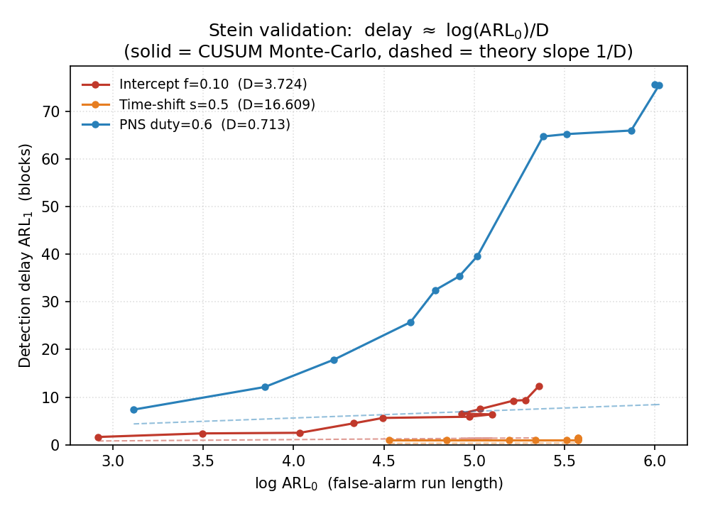
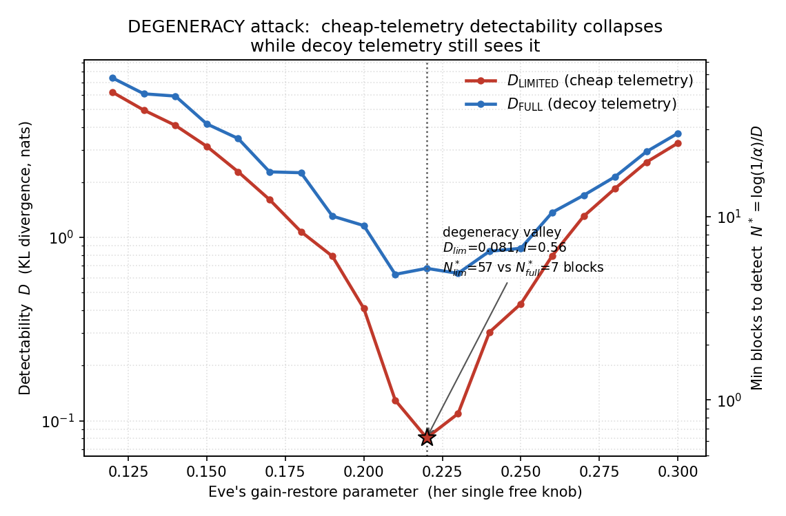
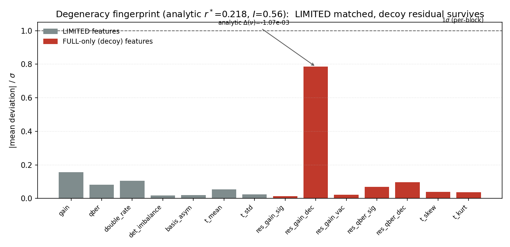
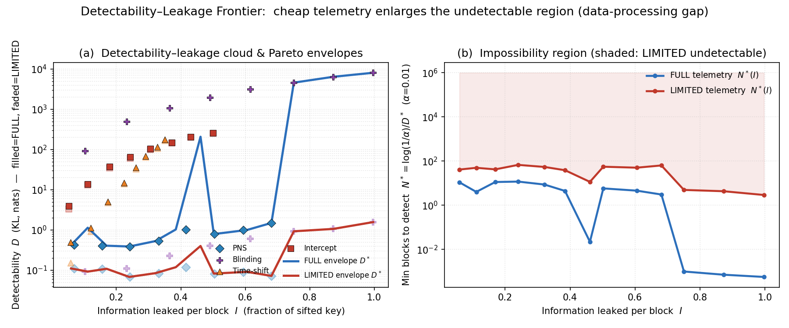
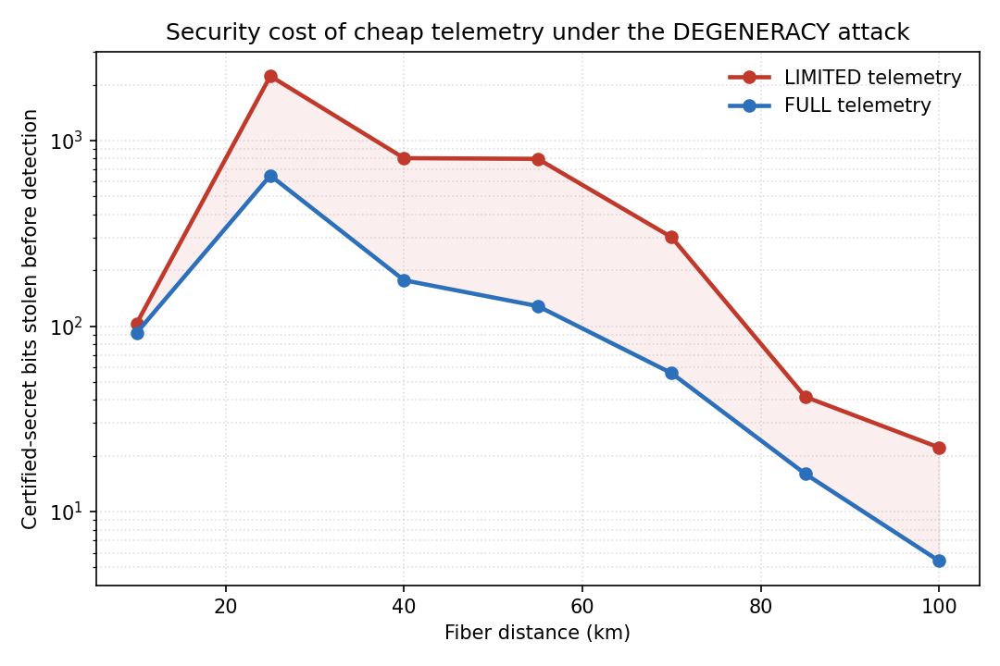
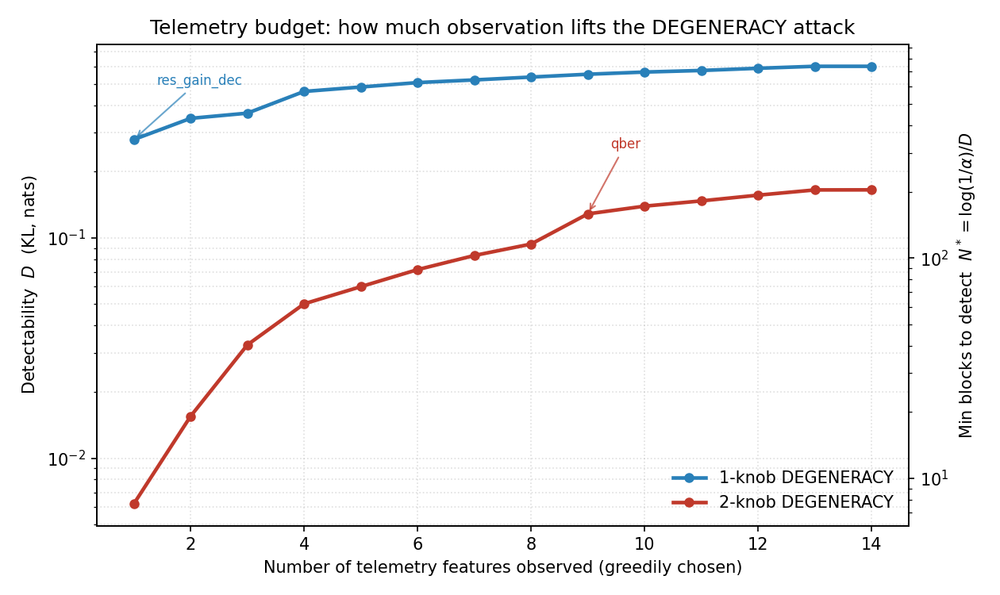
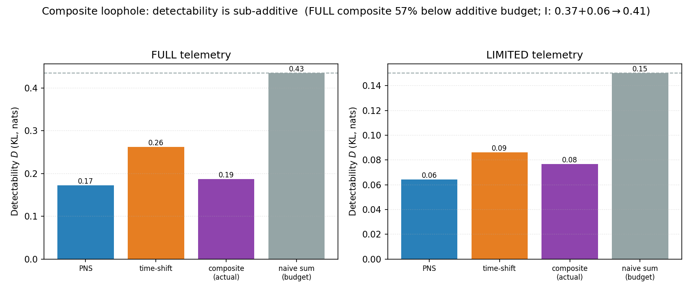
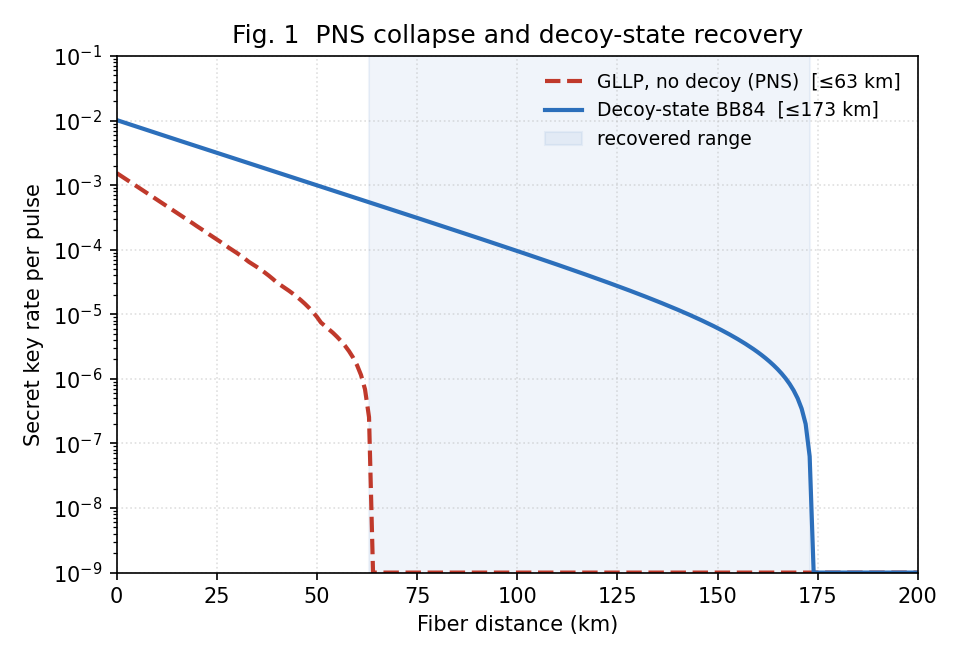

# SCATTER

**Sequential CUSUM Analysis of Telemetry for Threat-Exposure Regions** — an
information-theoretic framework for the security of telemetry-based intrusion
detection in decoy-state BB84 quantum key distribution, and the **DEGENERACY
attack**, an eavesdropper that hides in cheap telemetry while stealing the key.

Pure Monte-Carlo simulation. No hardware required.

---

## Motivation

The textbook security signal of BB84 is the quantum bit error rate (QBER): if it
stays below ~11 %, the key is accepted. But device-imperfection attacks
(photon-number splitting, detector blinding, time-shift) leave the QBER at its
honest value while leaking most of the key. Modern defenses add machine-learning
intrusion detection on richer **telemetry** — detector click statistics, timing
histograms, decoy residuals. This repository asks a sharper question:

> **How much telemetry must you observe, and for how long, before an eavesdropper
> is fundamentally undetectable?**

We answer it with an information-theoretic bound rather than an empirical
classifier score, and we exhibit an attack that saturates it.



*Intercept-resend is caught (QBER past the abort threshold) but leaks little; PNS,
time-shift, and stealthy blinding sit at honest QBER while Eve knows 35–100 % of
the key.*

## The two contributions

### 1. SCATTER — detectability as an information-theoretic quantity

Each block of ~10⁴–10⁶ pulses produces a telemetry vector whose law is Gaussian
by the central limit theorem. The detectability of an attack is the KL divergence
between the honest and attacked telemetry laws, and by the Stein/Lorden theorem
the minimum number of blocks any detector needs is

```
N*_T = log(1/α) / D_T ,      D_T = KL( P₁ ‖ P₀ )  on telemetry set T.
```

Two theorems drive every result:
- **Data-processing inequality:** dropping features (LIMITED ⊂ FULL) can only
  *lower* detectability, `D_LIMITED ≤ D_FULL`, so cheap telemetry strictly raises
  the detection delay.
- **Stein floor:** even an omniscient detector obeys `N* ≥ log(1/α)/D`, so
  `D → 0` means undetectable at any latency.

The floor is validated against a Monte-Carlo CUSUM detector:



*Empirical CUSUM detection delay stays above the information floor `log(ARL₀)/D`;
small-D attacks (PNS) are fundamentally slow to detect.*

### 2. The DEGENERACY attack — collapsing honest and attacked telemetry

The eavesdropper tunes gain-matched PNS so that, under LIMITED telemetry, the
attacked telemetry law becomes **observationally degenerate** with honest
operation — every cheap feature matches to within statistical noise — while she
still learns the multi-photon bits. An analytic derivation predicts the single
surviving trace (a decoy-channel residual) in closed form.



*As Eve tunes her one free knob, cheap-telemetry detectability collapses into a
valley (D≈0.08, 57 blocks to detect) while decoy telemetry still sees her
(6.8 blocks). An 8× detection-delay penalty from cheap telemetry.*



*At the analytic optimum, all seven LIMITED features match honest to <0.2σ; the
lone survivor is a single decoy residual — the degeneracy fingerprint.*

## Main results

**The impossibility region.** Sweeping attacks and duty cycles traces the
Pareto frontier of leakage vs detectability. Under LIMITED telemetry the minimum
detection delay stays high across all leakage levels; under FULL it collapses.



**The security cost.** Translated into finite-key terms, cheap telemetry lets the
DEGENERACY attack steal 3–6× more *certified-secret* key before detection, across
25–100 km of fiber.



**How much telemetry is enough?** Greedily adding features shows the 1-knob
attack is lifted out of degeneracy by a single decoy-gain residual, while the
2-knob attack resists the entire feature set — no observable catches it quickly.



**Combined loopholes are sub-additive.** On a receiver with detector-efficiency
mismatch, a composite of PNS and time-shift leaks the sum of their information at
roughly the detectability of the stealthier one alone — 57 % below the additive
detection budget a defender would assume.



**Physics validation.** The simulator reproduces the textbook decoy-state result
(no-decoy PNS key rate collapses at ~63 km; decoy-state extends secure range to
~173 km), certifying the analytic layer.



## Repository structure

```
qkd/
  params.py       physical + protocol parameter containers
  source.py       weak coherent pulse (Poisson photon number)
  channel.py      fiber loss (Bernoulli thinning)
  detector.py     threshold detector pair (efficiency, dark counts, crosstalk)
  session.py      per-pulse Monte-Carlo pipeline with attack hooks
  attacks.py      intercept-resend, PNS, blinding, time-shift (+ calibration)
  telemetry.py    LIMITED vs FULL block-feature extraction
  keyrate.py      GLLP + decoy-state (Ma et al. 2005) key rates
  finitekey.py    epsilon-secure finite-key length (Lim et al. 2014)
  infometrics.py  Gaussian KL detectability + Stein floor        [SCATTER]
  sequential.py   CUSUM sequential detector                       [SCATTER]
  degeneracy.py   analytic gain-match + decoy residual            [DEGENERACY]
  subset.py       KL on feature subsets + greedy telemetry budget
  adversary.py    adversarial D_lim minimisation
  security.py     finite-key certified-but-stolen ledger
  dataset.py      block dataset generation
  mldetect.py     one-class SVM / isolation-forest baseline
experiments/      figure-generating scripts (see below)
tests/            regression + validation suite
METHOD.md         detailed method write-up
```

## Experiments

Run any experiment from the repository root:

```bash
PYTHONPATH=. python experiments/<name>.py
```

| script | output |
|---|---|
| `fig1_decoy.py` | decoy vs no-decoy key rate (validation anchor) |
| `fig2_qber_blind.py` | Eve-info vs QBER: QBER is blind to stealth attacks |
| `fig3_ml_ablation.py` | one-class SVM ROC, LIMITED vs FULL |
| `exp_stein_validation.py` | CUSUM delay respects the Stein floor |
| `exp_frontier.py` | detectability–leakage frontier + impossibility region |
| `exp_degeneracy.py` | the degeneracy valley |
| `exp_fingerprint.py` | per-feature degeneracy fingerprint |
| `exp_stolen_key.py` | certified-secret key stolen vs distance |
| `exp_telemetry_budget.py` | greedy telemetry budget: which feature lifts the attack |
| `exp_composite.py` | combined loopholes: detectability is sub-additive |
| `smoke_attacks.py` | attack telemetry-signature sanity table |

## Installation

```bash
python -m venv .venv && source .venv/Scripts/activate   # or conda env
pip install -r requirements.txt
```

## Tests

```bash
python -m pytest tests/ -q
```

Covers key-rate limits, attack signatures, the data-processing inequality, the
Stein floor, the analytic degeneracy prediction, and the security ledger.

## References

- Gottesman, Lo, Lütkenhaus, Preskill, *Quant. Inf. Comput.* **4**, 325 (2004).
- Ma, Qi, Zhao, Lo, "Practical decoy state for QKD," *Phys. Rev. A* **72**, 012326 (2005).
- Lydersen et al., "Hacking commercial QKD systems by tailored bright illumination,"
  *Nat. Photonics* **4**, 686 (2010).
- Lorden, "Procedures for reacting to a change in distribution,"
  *Ann. Math. Stat.* **42**, 1897 (1971).
